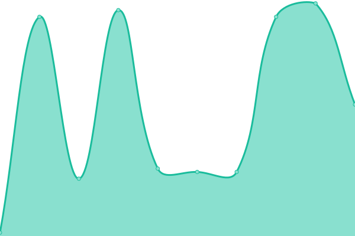

# [📈 Live Status](https://cattomgithub.github.io/monitor): <!--live status--> **🟩 All systems operational**

This repository contains the open-source uptime monitor and status page for [Cat Tom](https://cattom.site/), powered by [Upptime](https://github.com/upptime/upptime).

With [Upptime](https://upptime.js.org), you can get your own unlimited and free uptime monitor and status page, powered entirely by a GitHub repository. We use [Issues](https://github.com/cattomgithub/monitor/issues) as incident reports, [Actions](https://github.com/cattomgithub/monitor/actions) as uptime monitors, and [Pages](https://cattomgithub.github.io/monitor) for the status page.

<!--start: status pages-->
<!-- This summary is generated by Upptime (https://github.com/upptime/upptime) -->
<!-- Do not edit this manually, your changes will be overwritten -->
<!-- prettier-ignore -->
| URL | Status | History | Response Time | Uptime |
| --- | ------ | ------- | ------------- | ------ |
|  2 Ucloud Beijing | 🟩 Up | [2-ucloud-beijing.yml](https://github.com/cattomgithub/monitor/commits/HEAD/history/2-ucloud-beijing.yml) | 

 216ms
     
 | 

<a href="https://status.cattom.site/history/2-ucloud-beijing">100.00%</a>
    

|  3 Buyvm Las Vegas | 🟩 Up | [3-buyvm-las-vegas.yml](https://github.com/cattomgithub/monitor/commits/HEAD/history/3-buyvm-las-vegas.yml) | 

 58ms
     
 | 

<a href="https://status.cattom.site/history/3-buyvm-las-vegas">100.00%</a>
    

|  [Blog](https://blog.cattom.site) | 🟩 Up | [blog.yml](https://github.com/cattomgithub/monitor/commits/HEAD/history/blog.yml) | 

 915ms
     
 | 

<a href="https://status.cattom.site/history/blog">99.00%</a>
    

|  [Cloud](https://cloud.cattom.site:81) | 🟩 Up | [cloud.yml](https://github.com/cattomgithub/monitor/commits/HEAD/history/cloud.yml) | 

 974ms
     
 | 

<a href="https://status.cattom.site/history/cloud">100.00%</a>
    

|  [Drive](https://drive.cattom.site) | 🟩 Up | [drive.yml](https://github.com/cattomgithub/monitor/commits/HEAD/history/drive.yml) | 

 563ms
     
 | 

<a href="https://status.cattom.site/history/drive">98.47%</a>
    

|  [Get acme](https://get.acme.cattom.site) | 🟩 Up | [get-acme.yml](https://github.com/cattomgithub/monitor/commits/HEAD/history/get-acme.yml) | 

 581ms
     
 | 

<a href="https://status.cattom.site/history/get-acme">99.66%</a>
    

<!--end: status pages-->

[**Visit our status website →**](https://cattomgithub.github.io/monitor)

## 📄 License

- Powered by: [Upptime](https://github.com/upptime/upptime)
- Code: [MIT](./LICENSE) © [Cat Tom](https://cattom.site/)
- Data in the `./history` directory: [Open Database License](https://opendatacommons.org/licenses/odbl/1-0/)
